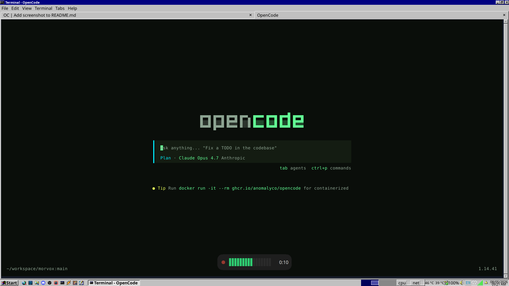

# morvox

A tiny push-to-talk-style voice-to-text widget for Linux, macOS, and Windows 11.

One command (`morvox`) that toggles:

1. **First press** → starts recording from the default mic, remembers the
   currently focused window/app, and shows a "Recording…" widget.
2. **Second press** → stops the recorder, transcribes the clip with
   `whisper-cli` (whisper.cpp), re-focuses the original window/app, and
   types the transcription into it.

morvox auto-selects a platform backend:

- **Linux/X11** — uses `parecord` for capture and `xdotool` for window
  control + keystroke injection.
- **macOS** — uses `ffmpeg` (avfoundation) for capture and `osascript`
  (System Events) for window focus + keystrokes.
- **Windows 11** — uses `ffmpeg` (WASAPI) for capture and Win32 APIs for
  window focus + keystrokes.

You can force a backend with `MORVOX_BACKEND=x11`, `MORVOX_BACKEND=macos`,
or `MORVOX_BACKEND=windows`.

## Table of Contents

- [Epistemology](#epistemology)
- [Screenshots](#screenshots)
- [What it does](#what-it-does)
- [Setup & installation](INSTALLATION.md)
  - [Dependencies](INSTALLATION.md#dependencies)
  - [Installation](INSTALLATION.md#installation)
  - [Hotkey configuration](INSTALLATION.md#hotkey-configuration)
    - [Linux hotkey (i3)](INSTALLATION.md#linux-hotkey-i3)
    - [macOS hotkey](INSTALLATION.md#macos-hotkey)
      - [skhd](INSTALLATION.md#skhd)
      - [Hammerspoon](INSTALLATION.md#hammerspoon)
    - [Windows hotkey](INSTALLATION.md#windows-hotkey)
- [Usage](#usage)
- [The widget](#the-widget)
- [Troubleshooting](#troubleshooting)
- [License](#license)

## Epistemology

The name is based on morhook and voice. mor-vox. I know, if I explain the joke, it's not funny. Don't judge me.

## Screenshots




## What it does

- It wraps whisper-cli and shows a VU meter on the user interface. You need to add the hotkey configuration on your OS/Desktop Environment.

## Setup & installation

Setup, dependencies, install steps, and hotkey configuration are in
[`INSTALLATION.md`](INSTALLATION.md).

## Usage

```sh
# toggle (start, then stop+transcribe+type)
./morvox
# Windows: python morvox

# status (for i3blocks / polybar)
./morvox --status        # prints "recording" or "idle"

# abort an in-flight recording without transcribing
./morvox --cancel

# keep the wav/txt around for debugging
./morvox --keep-temp

# use a different model / source / typing speed
./morvox --model /path/to/ggml-tiny.en.bin
./morvox --source alsa_input.usb-Maono_Maonocaster…
./morvox --threads 8
./morvox --type-delay 5

# disable the floating widget (headless / SSH / debugging)
./morvox --no-widget
```

State files live in `/tmp/morvox/` on Linux,
`~/Library/Caches/morvox/` on macOS, and `%LOCALAPPDATA%\morvox\` on
Windows (override with the `MORVOX_STATE_DIR` env var):

- `rec.pid` — recorder PID
- `target_window` — saved focused window id
- `rec.wav` / `rec.txt` — audio + transcript
- `parecord.log` / `whisper.log` — diagnostic logs

By default these are deleted after a successful type. Pass `--keep-temp`
to keep them.

## The widget

While recording, morvox shows a small borderless window centred near the
bottom of the screen. It contains:

- a pulsing red dot (recording indicator),
- a live VU meter that reacts to your microphone level,
- an elapsed-time counter.

When you stop recording, the meter is replaced by a "Transcribing…"
spinner that stays visible until whisper finishes and the transcript has
been typed. If whisper produced only silence the widget briefly shows
"No speech detected" instead.

The widget is a self-spawned subprocess of `morvox` (uses Python's
stdlib `tkinter`). Its stderr is written to the platform state dir's
`widget.log` for debugging. On Linux/X11 it uses
`_NET_WM_WINDOW_TYPE_DOCK` so i3 won't try to tile it. On Wayland-only
sessions without XWayland, or on hosts without `$DISPLAY`, the widget is
skipped silently.

To disable the widget entirely (e.g. on a headless machine or over SSH),
pass `--no-widget`.

## Troubleshooting

- **No audio recorded / empty wav (Linux)**
  Check the active sources: `pactl list short sources`. Pass an explicit
  source with `--source <NAME>`. Inspect `/tmp/morvox/parecord.log`.

- **No audio recorded / empty wav (macOS)**
  List devices with `ffmpeg -f avfoundation -list_devices true -i ""`
  and pass an explicit `--source :<idx>`. Inspect
  `~/Library/Caches/morvox/parecord.log`. If ffmpeg complains about
  permissions, grant the terminal Microphone access.

- **No audio recorded / empty wav (Windows)**
  List WASAPI devices with `ffmpeg -list_devices true -f wasapi -i dummy`
  and pass an explicit `--source "<device name>"`. Inspect
  `%LOCALAPPDATA%\morvox\parecord.log`. If ffmpeg cannot access the
  microphone, check **Settings -> Privacy & security -> Microphone**.

- **Text typed into wrong window**
  The originally focused window/app may have been destroyed before you
  stopped recording. morvox falls back to typing into whatever is
  currently focused and prints a warning to stderr.

- **Linux Wayland: nothing is typed (GNOME/Ubuntu)**
  GNOME/Mutter doesn't implement the `wtype` keyboard protocol and
  `xdotool` is a no-op against native Wayland windows. Either set up
  `ydotoold` (`sudo systemctl enable --now ydotoold` and add your user
  to the `input` group), or install `wl-clipboard` so the transcript
  lands on your clipboard for manual Ctrl+Shift+V. See
  [`INSTALLATION.md` (Linux / Wayland)](INSTALLATION.md#linux--wayland).

- **Linux: widget never appears (asdf/pyenv/conda Python)**
  The widget runs as a Python subprocess and needs `tkinter`. Many
  third-party Python builds ship without it. Check
  `/tmp/morvox/widget.log` for `No module named 'tkinter'`. Install
  `python3-tk` and run morvox under the system Python, rebuild your
  managed Python with Tk support, or use `--no-widget` to silence the
  warning.

- **macOS: keystrokes silently do nothing**
  Accessibility permission isn't granted. **System Settings → Privacy &
  Security → Accessibility** → enable your terminal app.

- **Windows: text does not type into an elevated app**
  Windows blocks lower-integrity processes from injecting keystrokes into
  elevated/admin windows. Run morvox from an elevated terminal too, or type
  into a non-elevated app.

- **Whisper too slow**
  Use a smaller model — `ggml-tiny.en.bin` is roughly 5× faster than
  `base.en` with a small accuracy hit. Increase `--threads` up to your
  physical core count.

- **Nothing is typed and notification says "Empty recording"**
  Whisper produced only a noise token (e.g. `[BLANK_AUDIO]`). Speak
  closer to the mic or check input gain.

## License

MIT — see [LICENSE](LICENSE).
