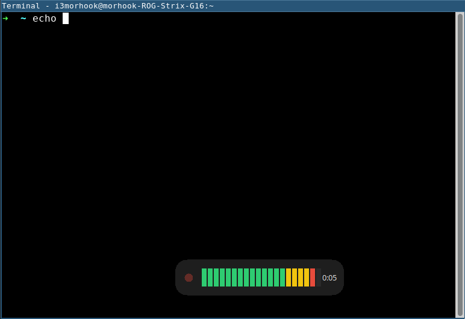
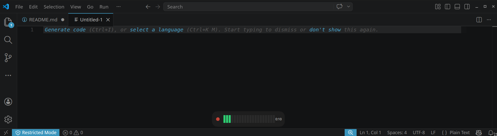
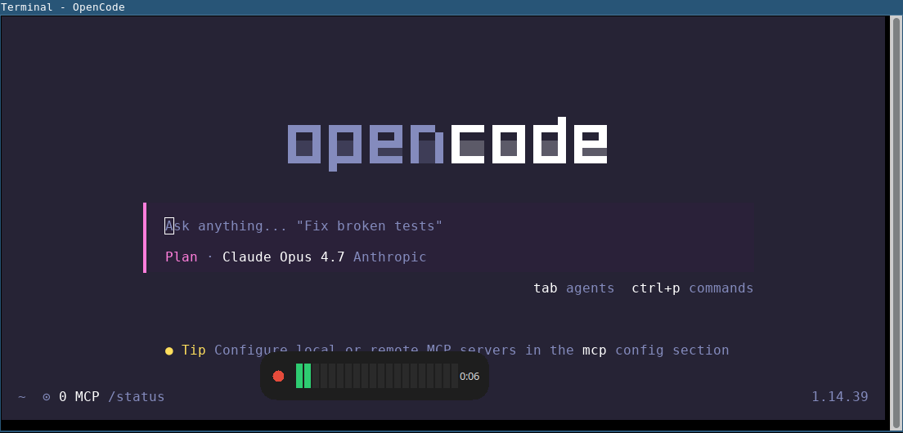

# morvox

A tiny push-to-talk-style voice-to-text widget for i3/X11 — and now macOS.

One command (`morvox`) that toggles:

1. **First press** → starts recording from the default mic, remembers the
   currently focused window/app, and shows a "Recording…" widget.
2. **Second press** → stops the recorder, transcribes the clip with
   `whisper-cli` (whisper.cpp), re-focuses the original window/app, and
   types the transcription into it.

morvox auto-selects a platform backend:

- **Linux/X11** — uses `parecord` for capture and `xdotool` for window
  control + keystroke injection.
- **macOS** — uses `ffmpeg` (avfoundation) for capture and `osascript`
  (System Events) for window focus + keystrokes.

You can force a backend with `MORVOX_BACKEND=x11` or `MORVOX_BACKEND=macos`.

## Table of Contents

- [Epistemology](#epistemology)
- [Screenshots](#screenshots)
- [What it does](#what-it-does)
- [Dependencies](#dependencies)
  - [Linux / X11](#linux--x11)
  - [Linux / Wayland](#linux--wayland)
  - [macOS](#macos)
    - [macOS permissions (first run will fail without them)](#macos-permissions-first-run-will-fail-without-them)
    - [Listing audio input devices on macOS](#listing-audio-input-devices-on-macos)
  - [Pointing morvox at your whisper.cpp build](#pointing-morvox-at-your-whispercpp-build)
- [Installation](#installation)
- [Usage](#usage)
- [The widget](#the-widget)
- [i3 keybinding (Linux)](#i3-keybinding-linux)
- [Hotkey on macOS](#hotkey-on-macos)
  - [skhd](#skhd)
  - [Hammerspoon](#hammerspoon)
- [Troubleshooting](#troubleshooting)
- [License](#license)

## Epistemology

The name is based on morhook and voice. mor-vox. I know, if I explain the joke, it's not funny. Don't judge me.

## Screenshots





## What it does

- Records 16 kHz mono WAV (whisper.cpp's native input) via `parecord`.
- Shows a small floating widget while recording with a live VU meter and
  pulsing indicator, then a spinner during transcription.
- Saves the focused window id at start so the transcript ends up in the
  same window even if focus has changed by the time you stop.
- Cleans whisper output: collapses newlines/whitespace into single spaces
  so multi-sentence dictation is typed inline.
- Filters common whisper "noise" tokens (`[BLANK_AUDIO]`, `[silence]`,
  `[Music]`, …) and briefly shows "No speech detected" instead of typing
  them.
- Stale-lock safe: a leftover PID file whose process is dead is treated
  as "not recording".

## Dependencies

### Linux / X11

- Python 3 (standard library only, including `tkinter` for the widget)
- `xdotool`
- `pulseaudio-utils` (provides `parecord` and `parec`) — works fine with
  PipeWire's pulse shim
- A built [whisper.cpp](https://github.com/ggerganov/whisper.cpp) — the
  `whisper-cli` binary at `<whisper-dir>/build/bin/whisper-cli`
- A whisper model, e.g. `<whisper-dir>/models/ggml-base.en.bin`

On Debian/Ubuntu, `tkinter` is in the `python3-tk` package; on Arch it
ships with `python`. If `tkinter` is missing, run with `--no-widget`
(morvox will print a one-time warning and continue without the widget).

If you use a third-party Python (asdf, pyenv, conda, …) and the widget
never appears, check `/tmp/morvox/widget.log` — that interpreter is
probably built without `_tkinter`. Either install the system `python3-tk`
and use the system Python, or rebuild your managed Python with Tk
support.

### Linux / Wayland

morvox auto-detects Wayland (`$WAYLAND_DISPLAY`) and uses a different
typing strategy because `xdotool type` silently no-ops on native Wayland
windows. In order of preference morvox tries:

1. **`wtype`** — uses `zwp_virtual_keyboard_v1`. Works on
   Sway/Hyprland/KWin/river. Does **not** work on GNOME/Mutter (the
   protocol isn't implemented).
2. **`ydotool`** — uses `/dev/uinput` and works on every compositor,
   including GNOME, but requires the `ydotoold` daemon to be running and
   your user to have access to `/dev/uinput` (typically via the `input`
   group).
3. **`wl-copy` clipboard fallback** — copies the transcript to the
   clipboard and synthesises Ctrl+Shift+V via whichever of `wtype` /
   `ydotool` is available. If neither can inject keystrokes, the
   transcript is left on the clipboard and you paste manually.

Recommended on **GNOME Wayland (Ubuntu default)**:

```sh
sudo apt install ydotool wl-clipboard python3-tk
sudo systemctl enable --now ydotoold        # provides the daemon
sudo usermod -aG input "$USER"              # then log out/in
```

If you don't want to set up `ydotoold`, install `wl-clipboard` only —
morvox will still copy the transcript to the clipboard and you can paste
with Ctrl+Shift+V.

### macOS

```sh
brew install ffmpeg whisper-cpp python-tk
```

`osascript` ships with macOS, so no separate install for keystroke
injection. `whisper-cpp` from Homebrew installs the `whisper-cli`
binary; morvox also looks under `/opt/homebrew/share/whisper.cpp` and
`/usr/local/share/whisper.cpp` automatically.

Optional but recommended for accurate multi-monitor placement and
pointer detection:

```sh
pip install pyobjc-framework-Quartz pyobjc-framework-Cocoa
```

Without PyObjC the widget falls back to Tk's primary-screen size.

#### macOS permissions (first run will fail without them)

- **Microphone** — required for `ffmpeg` capture. Grant the controlling
  terminal (Terminal.app, iTerm2, …) microphone access in
  **System Settings → Privacy & Security → Microphone**.
- **Accessibility** — required for `osascript` to send keystrokes and
  switch frontmost apps. Grant the same terminal access in
  **System Settings → Privacy & Security → Accessibility**.

If keystrokes silently do nothing or you see error `-1743` /
"not allowed to send keystrokes", Accessibility hasn't been granted.

#### Listing audio input devices on macOS

The `--source` flag takes an avfoundation index (e.g. `:0`, `:1`). To
list devices:

```sh
ffmpeg -f avfoundation -list_devices true -i ""
```

The default (`:0`) is usually the system default input.

### Pointing morvox at your whisper.cpp build

morvox locates whisper.cpp in this order:

1. `$MORVOX_WHISPER_DIR` if set
2. `~/.local/share/whisper.cpp` if it exists
3. `~/soft/whisper.cpp` (legacy fallback)

Set it explicitly in your shell rc if your build lives elsewhere:

```sh
export MORVOX_WHISPER_DIR="$HOME/code/whisper.cpp"
```

You can also bypass the directory entirely and pass the model directly
with `--model /path/to/ggml-base.en.bin`.

## Installation

```sh
git clone https://github.com/morhook/morvox.git
cd morvox
chmod +x morvox

# optional: put it on your PATH
ln -s "$PWD/morvox" ~/.local/bin/morvox
```

## Usage

```sh
# toggle (start, then stop+transcribe+type)
./morvox

# status (for i3blocks / polybar)
./morvox --status        # prints "recording" or "idle"

# abort an in-flight recording without transcribing
./morvox --cancel

# keep the wav/txt around for debugging
./morvox --keep-temp

# use a different model / source / typing speed
./morvox --model /path/to/ggml-tiny.en.bin
./morvox --source alsa_input.usb-Maono_Maonocaster…
./morvox --threads 8
./morvox --type-delay 5

# disable the floating widget (headless / SSH / debugging)
./morvox --no-widget
```

State files live in `/tmp/morvox/` on Linux and
`~/Library/Caches/morvox/` on macOS (override with the
`MORVOX_STATE_DIR` env var):

- `rec.pid` — recorder PID
- `target_window` — saved focused window id
- `rec.wav` / `rec.txt` — audio + transcript
- `parecord.log` / `whisper.log` — diagnostic logs

By default these are deleted after a successful type. Pass `--keep-temp`
to keep them.

## The widget

While recording, morvox shows a small borderless window centred near the
bottom of the screen. It contains:

- a pulsing red dot (recording indicator),
- a live VU meter that reacts to your microphone level,
- an elapsed-time counter.

When you stop recording, the meter is replaced by a "Transcribing…"
spinner that stays visible until whisper finishes and the transcript has
been typed. If whisper produced only silence the widget briefly shows
"No speech detected" instead.

The widget is a self-spawned subprocess of `morvox` (uses Python's
stdlib `tkinter`). Its stderr is written to `/tmp/morvox/widget.log` for
debugging. It is X11-focused and uses `_NET_WM_WINDOW_TYPE_DOCK` so i3
won't try to tile it. On Wayland-only sessions without XWayland, or on
hosts without `$DISPLAY`, the widget is skipped silently.

To disable the widget entirely (e.g. on a headless machine or over SSH),
pass `--no-widget`.

## i3 keybinding (Linux)

Add to `~/.config/i3/config` (the script does **not** touch your config);
adjust the path to wherever you installed `morvox`:

```
bindsym $mod+grave exec --no-startup-id ~/.local/bin/morvox
```

Reload i3 (`$mod+Shift+r`) and press `$mod+\`` to start/stop dictation.

## Hotkey on macOS

morvox doesn't bind hotkeys itself; pair it with a hotkey daemon.

### skhd

```sh
brew install skhd
brew services start skhd
```

Add to `~/.config/skhd/skhdrc`:

```
cmd - 0x32 : /opt/homebrew/bin/morvox
```

`0x32` is the backtick (`` ` ``) keycode. Reload skhd
(`skhd --reload`) and press `Cmd+\`` to toggle.

### Hammerspoon

```lua
hs.hotkey.bind({"cmd"}, "`", function()
  hs.execute("/opt/homebrew/bin/morvox", true)
end)
```

## Troubleshooting

- **No audio recorded / empty wav (Linux)**
  Check the active sources: `pactl list short sources`. Pass an explicit
  source with `--source <NAME>`. Inspect `/tmp/morvox/parecord.log`.

- **No audio recorded / empty wav (macOS)**
  List devices with `ffmpeg -f avfoundation -list_devices true -i ""`
  and pass an explicit `--source :<idx>`. Inspect
  `~/Library/Caches/morvox/parecord.log`. If ffmpeg complains about
  permissions, grant the terminal Microphone access.

- **Text typed into wrong window**
  The originally focused window/app may have been destroyed before you
  stopped recording. morvox falls back to typing into whatever is
  currently focused and prints a warning to stderr.

- **Linux Wayland: nothing is typed (GNOME/Ubuntu)**
  GNOME/Mutter doesn't implement the `wtype` keyboard protocol and
  `xdotool` is a no-op against native Wayland windows. Either set up
  `ydotoold` (`sudo systemctl enable --now ydotoold` and add your user
  to the `input` group), or install `wl-clipboard` so the transcript
  lands on your clipboard for manual Ctrl+Shift+V. See the
  [Linux / Wayland](#linux--wayland) section.

- **Linux: widget never appears (asdf/pyenv/conda Python)**
  The widget runs as a Python subprocess and needs `tkinter`. Many
  third-party Python builds ship without it. Check
  `/tmp/morvox/widget.log` for `No module named 'tkinter'`. Install
  `python3-tk` and run morvox under the system Python, rebuild your
  managed Python with Tk support, or use `--no-widget` to silence the
  warning.

- **macOS: keystrokes silently do nothing**
  Accessibility permission isn't granted. **System Settings → Privacy &
  Security → Accessibility** → enable your terminal app.

- **Whisper too slow**
  Use a smaller model — `ggml-tiny.en.bin` is roughly 5× faster than
  `base.en` with a small accuracy hit. Increase `--threads` up to your
  physical core count.

- **Nothing is typed and notification says "Empty recording"**
  Whisper produced only a noise token (e.g. `[BLANK_AUDIO]`). Speak
  closer to the mic or check input gain.

## License

MIT — see [LICENSE](LICENSE).
